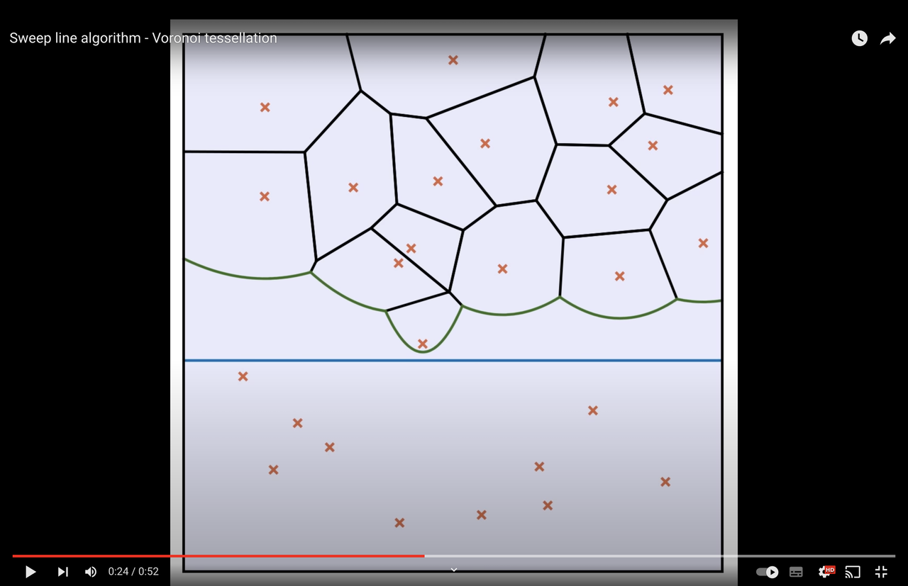
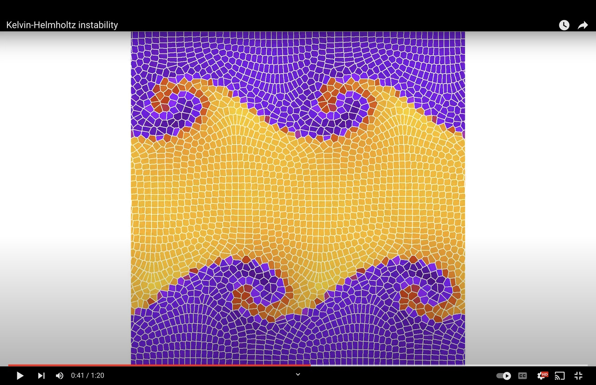
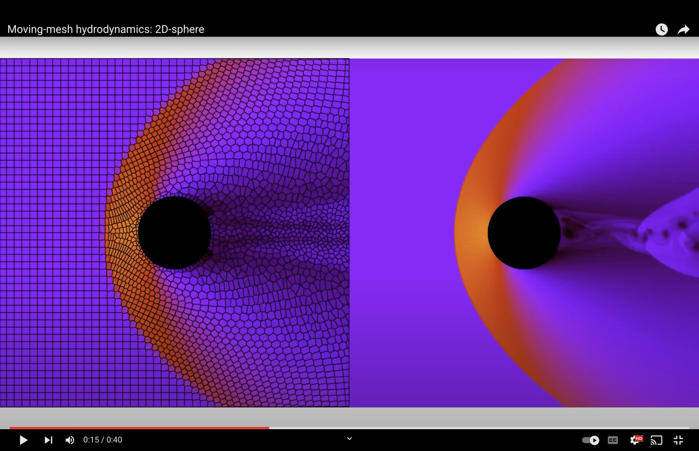

# Havoc - Here's another Voronoi code

2D hydrodynamics code that solves the Euler equations on a moving Voronoi mesh. I have written this code from scratch for my diploma thesis in physics; it's not perfect, but sharing is caring. For further explanations you may have a look at my [thesis](havoc-thesis.pdf). For major scientific applications I recommend you check out the [Arepo code](https://arepo-code.org/).

# Features

- Hydrodynamics on a moving Voronoi mesh
- Adaptive mesh refinement
- Simulation of obstacles

# Usage

## Requirements

The code and scripts were developed on Linux. With minor adjustments you can also run them on macOS and Windows, as explained [below](#macos).

The following tools are required:

- git
- make
- g++
- gnuplot
- ffmpeg

## Run simulations

- Copy the folder new_simulation_prototype and give it a new name, e.g. simulation_1. Navigate into the new folder.
- Open the ini.cpp file and set the initial conditions for your simulation. Either set the conserved fluid variables or set the primitive variables and then call `updateCellVolumesAndCenters` and `calculateConservedVariables`.
- Set the parameters for the simulation in the file named 'constants'.
- Build the code by running the script make.sh. The binary 'havoc' will be created.
- Run the code with the command `./havoc`.

If you don't alter the initial conditions and parameters a Kelvin-Helmholtz simulation will be run for a short time. The code produces binary `.hc` output files and a text file `sim_info` with additional information about the simulation.

## Processing

The `havoc` binary can also convert the binary output to text files, create sections of the output and more. You can see all available commands by invoking `./havoc --help`. In addition, there are several scripts in the simulation folder that help you to process the data. Here are some examples:

- Convert the binary file 00005.hc to text files: `./havoc --convert=00005.hc`. Alternatively, use the convert script: `./convert.sh 5`.
- Convert the binary files between 00000.hc and 00100.hc: `./convert.sh 0 100`.
- Convert the binary files between 00000.hc and 00100.hc but only every second file: `./convert.sh 0 100 2`.
- Optimized conversion for box type 1: `./havoc --convert=00005.hc --hybrid`.
- Cut the box during the conversion: `./havoc --convert=000005.hc --cut --xmin=-0.1 --xmax=0.1 --ymin=-0.1 --ymax=0.1`.
- Display the surface density of file 00005.hc with gnuplot: `./density2D.sh 5`.
- Display the surface density and the graph of file 00005.hc: `./density2D.sh 5 g`.
- Print the minimum and maximum values of the primitive variables for the output 00005.hc: `./havoc --minmax 00005.hc`.
- Create a density movie from the converted files: `./densityMovie 0 100 1`.
- Delete all files associated with the simulation: `./clean.sh`.

## Example 

In order to run a Kelvin-Helmholtz simulation and create a movie similar to the one shown in the media section below, follow these steps: 

- Run the simulation as described above but set `MAX_T`, the maximum simulation time, to 2.0 in the constants file.
- In convert.sh append the --hybrid option to the havoc convert commands. This is an optimization for hybrid boxes, that is, boxes with periodic boundaries in x-direction and reflecting boundaries in y-direction.
- Convert all binary files: `./convert.sh 0 2000`.
- Get the minimum and maximum density across all output files: `./havoc --minmax 00000.hc --sub`. The latter option specifies that all subsequent files should also be taken into account.
- Adjust the color range in movie.plt, e.g., change the respective line to `set cbrange[0.8, 2.2]`. The range should include the minimum and maximum density value obtained from the previous command.
- Create a density movie: `./densityMovie.sh 0 2000 1`. The last parameter specifies the step size. Here, every file is taken into account. The file density_movie.mp4 is created.

## macOS

The Gnuplot scripts use the X11 terminal by default. On macOS you might want to install qt and change the line `set terminal X11` to `set terminal qt`. Moreover, pass the option `-pix_fmt yuv420p` to ffmpeg in order to make the generated movies work with the QuickTime player.

## Windows

For Windows I recommend you install Cygwin. In the installation setup select the packages 'make' and 'gcc-g++' from the Devel category. Install git, gnuplot and ffmpeg for Windows and add the bin folders to the Windows Path variable. Change the terminal in the gnuplot scripts by replacing the lines `set terminal X11` to `set terminal qt`. Lastly, pass the option `-pix_fmt yuv420p` to ffmpeg.

# Acknowledgements

I owe lots of thanks to my supervisor Prof. Kley, PD Dr. Speith and the whole Computational Physics team of the University Tübingen. I would also like to thank Prof. Springel for his feedback, as well as Prof. Toro for his kind permission to include the Riemann Solver from his book *Riemann Solvers and Numerical Methods for Fluid Dynamics* in this repository.

# Media

Here are some links to movies (click on the images) that show the code in action. 

